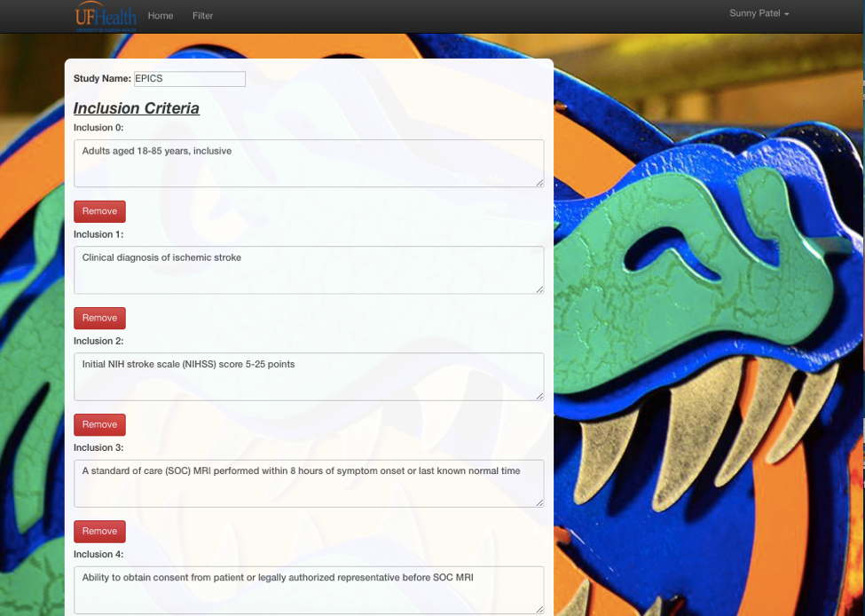

**- Link to Deployed Page**: https://softwareproject.herokuapp.com

**- Credits:**

-   https://www.w3schools.com

-   https://jsfiddle.net

-   Bootstrap Link: https://angular-ui.github.io/bootstrap/

Our client was the neurology department of Shands Hospital. The clients
were looking for an app to help them find any patients that came into
the emergency room and matched the requirements of any of the studies
they were conducting. Previously they had to look through a book that
included multiple studies and had to check the requirements of each
study for every patient that might have possibly met those requirements.
If there was a new study that patients could qualify for or a study that
was no longer being researched, the book would have to be reprinted.

Our clients knew that there must be a better way, and therefore sought
the help of some amazing programmers. In the short period of a semester
our team was able to create a web app to streamline and simplify the
process of finding matching patients as well as managing the detailed
studies they were conducting.

It starts with the home page where the user can choose between the study
filter and the administrator page.

**[Guest]{.underline}**

The study filter is the focal point of the app that will be used by all
of the department to quickly find patients that may match any of the
studies. The page begins with all possible criteria as inputs to the
filter (on the left), such as the patient's age or the type of stroke
the patient had experienced. As the patient's information is entered,
you will notice that the list of studies that the patient is eligible
for shortens. You will also see that the number of questions about the
patient will decrease because the questions dynamically change based on
what studies the patient qualifies for. If none of the studies remaining
require the answer of a certain question, that question will no longer
be asked to save the user's time.

If a study is found that matches the patient's information, the user can
send an email from the app to the coordinator in charge of that study so
that further research can be done on that specific patient.

**[Administrator]{.underline}**

This side allows all of the studies and requirements of each study to be
managed. This part of the app requires coordinators to login in order to
alter any of the database information. Studies can be added, edited,
archived (removed from main studies list but not completely deleted),
and permanently deleted from this branch.

To make the app much more dynamic, administrators can make new
requirements to be added to studies in the case that an unforeseen
requirement must be added. This can be done on the manage requirement
page. For example, if a new study needs a patient with blood type O
negative, this requirement can be added to the database, which can then
be added to the new study. There are three types of requirements which
are Boolean (true/false), Range (specific range of numeric values), or
Custom (two or more custom string options). A new study can be added to
the database with a new requirement, and when any user uses the filter
feature, then that new requirement will be listed as a patient question.

The edit study allows any textual information involving the study to be
altered, such as the lists of inclusion/exclusion principles or the
coordinator's information.

The archive study feature allows any study to be saved in a different
collection so that if the study is no longer being researched at the
time, but may return in the future, it can be recovered and transferred
back into the main study collection.

**- Screenshots**

-   **Home Page **

**\
**

-   **View list of all client studies and Filtering studies
    dynamically**

> 
>
-   **Display inclusion/exclusion criteria and Allow guest to send email
    to coordinator**

-   **Admin can edit client studies**

-   **Allow admin to Log-In**

-   **Allow admin to archive studies**

**\
**

-   **Allow admin to remove studies**

-   **Allow admin to add studies **

**\
**

**-Instructions for how to run the project locally**

To run the project locally, a user has to run the command "npm start"
while in the main directory of the project. In order for "npm start" to
run, command "npm install" has to be done previously in the terminal.
The project will then be found at localhost:3000.

**- How to update database and server connections**

The project uses MongoDB for the database. The uri for the DB can be
found in /config/env/development.js.
